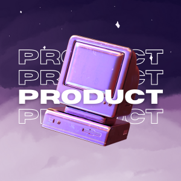

# NotebookLM Desktop

<p align="center">
  
</p>

<p align="center">
  <strong>A native Windows desktop app for Google NotebookLM</strong>
</p>

<p align="center">
  <a href="#-quick-start">Quick Start</a> •
  <a href="#-features">Features</a> •
  <a href="#-for-developers">For Developers</a>
</p>

<p align="center">
  <a href="https://github.com/GyaneshSamanta/NotebookLM-for-Windows/releases">
    
  </a>
  <a href="https://github.com/GyaneshSamanta/NotebookLM-for-Windows/releases">
    
  </a>
  <a href="https://www.buymeacoffee.com/gyaneshsamanta">
    
  </a>
</p>

---

## 🚀 Quick Start

### Download & Run (No Installation Required!)

1. **Download** the latest release from the [**Releases Page**](../../releases).
2. **Extract** the ZIP file to any folder.
3. **Run** `NotebookGLM.exe` inside the extracted folder.

That's it! No installation, no setup wizards. Just run and enjoy.

> **Tip:** Pin `NotebookGLM.exe` to your taskbar for quick access!

---

## ✨ Features

| Feature | Description |
|---------|-------------|
| 🖥️ **Native Window** | NotebookLM in its own dedicated window, separate from your browser |
| 🔐 **Persistent Login** | Stay signed in - your Google session persists across app restarts |
| 🔔 **Smart Notifications** | Get Windows toast notifications when audio generation completes |
| 📌 **System Tray** | Minimize to tray, keeps running in the background |
| 🚀 **Auto-Launch** | Optional: Start automatically when Windows boots |
| ☕ **Support the Developer** | Built-in Buy Me a Coffee link to support development |

---

## 🔔 How Notifications Work

The app monitors NotebookLM for completion events. When detected, it triggers a native Windows notification so you can work on other things.

**Detected Events:**
- Audio Overview generated
- Source added
- Note saved

---

## 💻 For Developers

### Project Structure

```
NotebookLM-for-Windows/
├── assets/icon.png         # App icon
├── main.js                  # Electron main process
├── preload.js               # Secure IPC bridge
├── renderer.js              # UI logic
├── webview-preload.js       # Notification detection
├── index.html               # App container
├── package.json             # Dependencies & scripts
├── build_installer.bat      # One-click build script
└── README.md
```

### Tech Stack

- **[Electron](https://www.electronjs.org/)** - Cross-platform desktop apps
- **[auto-launch](https://www.npmjs.com/package/auto-launch)** - Windows startup integration
- **Vanilla JS/HTML/CSS** - No framework bloat

### Build from Source

```bash
# Clone the repository
git clone https://github.com/GyaneshSamanta/NotebookLM-for-Windows.git
cd NotebookLM-for-Windows

# Install dependencies
npm install

# Run in development mode
npm start

# Build portable app (one-click)
build_installer.bat

# Or manually:
npm run pack
```

The built app will be in `release/NotebookGLM-win32-x64/`.

### Creating a GitHub Release

1. Run `build_installer.bat` or `npm run pack`
2. ZIP the `release/NotebookGLM-win32-x64` folder
3. Go to repo → **Releases** → **Draft a new release**
4. Create tag (e.g., `v1.2.0`), upload ZIP, publish!

---

## 📜 License

GPL-3.0 License - see [LICENSE](LICENSE) for details.

---

<p align="center">
  Built with ♥ by <a href="https://www.linkedin.com/in/gyanesh-samanta/">Gyanesh Samanta</a>
</p>

<p align="center">
  <a href="https://www.buymeacoffee.com/gyaneshsamanta">
    
  </a>
</p>
