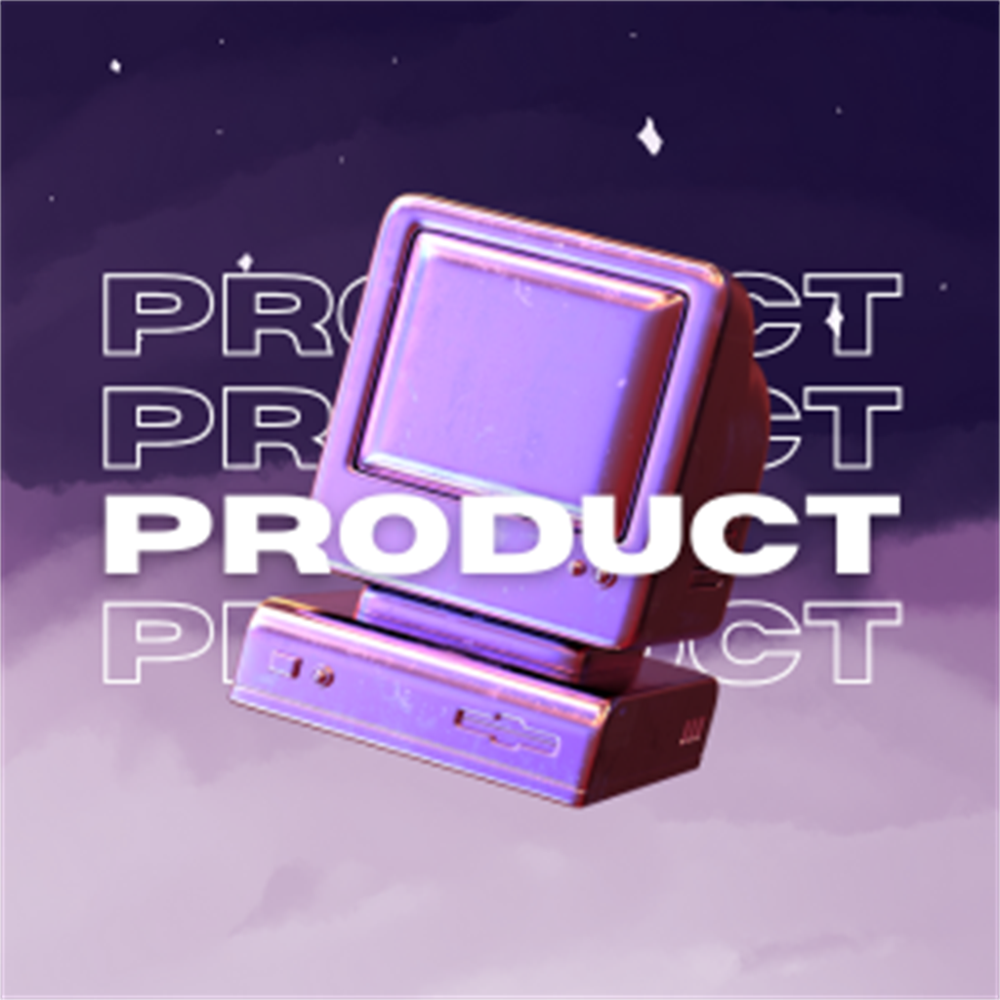
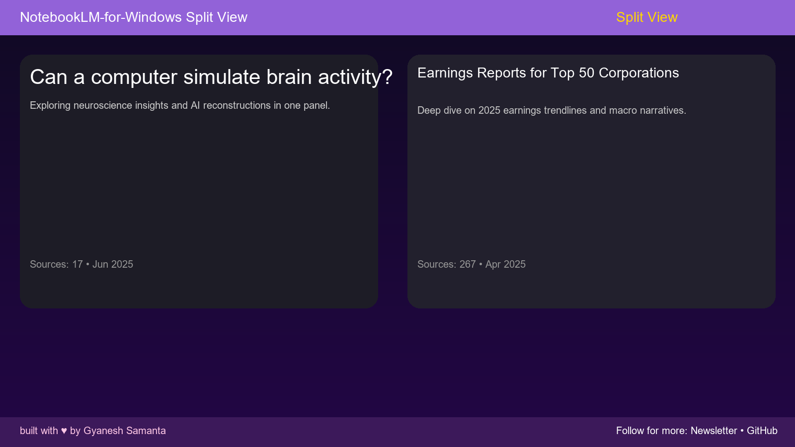
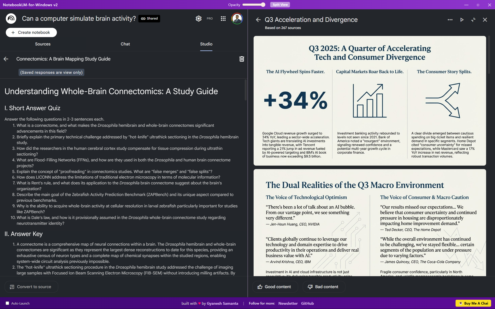

<div align="center">
  

  <h1>NotebookLM for Windows</h1>
  <p><strong>A native Windows desktop app for Google NotebookLM — with Ghost Mode, Quick-Clip, and Split View.</strong></p>

  <p>
    
    
    
    
    
    
  </p>

  <p>
    <a href="../../releases">Download</a> ·
    <a href="#-quick-start">Quick Start</a> ·
    <a href="#-the-story">Story</a> ·
    <a href="#-for-developers">For Developers</a>
  </p>
</div>

> [!NOTE]
> **Thank you for 2,000+ downloads.** I'm grateful to everyone who's installed and shipped feedback. Every contribution — even a 20-rupee [Buy Me A Chai](https://buymeachai.ezee.li/GyaneshOnProduct) (UPI supported) — keeps me building open-source.

---

## About — the 5 Ws

**What.** A native Windows desktop wrapper for Google NotebookLM, built on Electron, that turns the web app into a deeply integrated research utility — with transparency, global hotkeys, dual-pane research, and drag-and-drop file uploads.

**Who.** Built solo by **Gyanesh Samanta** ([@GyaneshSamanta](https://github.com/GyaneshSamanta)).

**When.** Active from **February 8 → May 2, 2026**, across roughly twenty focused commits and three major releases (v1.0, v2.0 feature set, v2.1 installer + auto-update).

**Where.** A nights-and-weekends project that's now in the hands of thousands of researchers, students, and analysts who wanted NotebookLM to behave like a first-class Windows app.

**Why.** NotebookLM is a phenomenal research tool — but living in a browser tab means you lose half its leverage. No global hotkey to capture a clipping. No transparency to reference a PDF underneath. No way to compare two notebooks side-by-side without two browser windows. This app fixes all of that.

---

## The Story

It started as a simple Electron wrapper around `notebooklm.google.com` — a frameless window with a custom title bar, persistent login, and Windows toast notifications when an Audio Overview finished generating. Useful, but still mostly a tab-with-extra-steps. The first download numbers (a few hundred) suggested people wanted *more* than a wrapper.

Version 2.0 was the leap. **Ghost Mode** added an opacity slider to the title bar, so the entire window can fade to translucent — perfect for transcribing from a video underneath or copying from a PDF without the constant Alt-Tab dance. **Quick-Clip** registered a global `Ctrl+Alt+N` hotkey: copy text from anywhere, hit the chord, and NotebookLM jumps to the foreground and pastes the clipping into the active note instantly. **Split View** turned the single window into a two-pane research studio sharing the same login session — one notebook on brain-activity research, another on the Q3 earnings call, side-by-side without juggling tabs. **Native drag-and-drop** lets you fling PDFs, TXT, and Markdown straight onto the window to trigger NotebookLM's upload pipeline. Every one of these features answers a complaint I had personally — and apparently most of the **2,000+ downloads** so far had it too.

Version 2.1 was the boring-but-important release: a real NSIS installer, an electron-updater pipeline that ships updates in the background, and a portable `.exe` for users who don't want anything touching their registry. The whole stack stays delightfully thin — Electron 34, vanilla JS/HTML/CSS, two runtime deps (`auto-launch`, `electron-updater`). Five files in `src/`. Five hundred lines of glue and a lot of obsessive UX polish.

---

## What's New in v2.0

| Feature | What it does |
|---|---|
| 👻 **Ghost Mode** | Opacity slider in the title bar makes the window translucent. Reference a PDF or video underneath without leaving NotebookLM. |
| ⚡ **Quick-Clip** | Copy from any app, press `Ctrl+Alt+N`, and the clipping pastes into the active note. |
| 🪟 **Split View** | Toggle a two-pane window with two different notebooks sharing one login. |
| 📥 **Drag-and-Drop** | Drop PDFs, TXT, or Markdown onto the window to trigger upload. |
| 🎨 **Redesigned UI** | Frameless window, custom title bar, deep-purple gradient palette. |

---

## Quick Start

### Download & Run

1. Grab the latest release from the [**Releases page**](../../releases).
2. Pick your flavour:
   - **Installer** (`-Setup.exe`) — recommended. Adds shortcuts and enables background auto-update.
   - **Portable** (`.exe`) — just download and run, nothing touches your system.
3. Run it. That's the whole setup.

> **Tip:** Pin `NotebookLM-for-Windows.exe` to your taskbar for one-click access.

> [!WARNING]
> **Upgrading from < v2.1?** Switch to the **Installer** build — that's where automatic background updates kick in.

---

## Full Feature List

| Feature | Description |
|---|---|
| 👻 **Ghost Mode** | Custom opacity slider to see through the window |
| ⚡ **Quick-Clip** | Global `Ctrl+Alt+N` hotkey for clipboard → note |
| 🪟 **Split View** | Two notebooks side-by-side, one session |
| 📥 **Drag & Drop** | Drop files natively onto the app |
| 🖥️ **Native App** | Frameless window, custom controls |
| 🔐 **Persistent Login** | Stay signed in via secure AppData storage |
| 🔔 **Notifications** | Windows toast on Audio Overview / source / note events |
| 📌 **System Tray** | Minimize-to-tray for quick access |
| 🚀 **Auto-Launch** | Start quietly when Windows boots |
| ☕ **Support** | [Buy Me A Chai](https://buymeachai.ezee.li/GyaneshOnProduct) — UPI supported |

---

## Gallery





---

## How Notifications Work

The app monitors NotebookLM for completion events through a `webview-preload.js` shim and surfaces a native Windows toast when one fires.

**Detected events:**
- Audio Overview generated
- Source added
- Note saved

---

## Tech Stack

- **[Electron 34](https://www.electronjs.org/)** — desktop runtime
- **[auto-launch](https://www.npmjs.com/package/auto-launch)** — Windows startup integration
- **[electron-updater](https://www.electron.build/auto-update)** — background auto-update channel
- **[electron-builder](https://www.electron.build/)** — NSIS installer + portable `.exe` packaging
- **Vanilla JS / HTML / CSS** — no framework, no bundler, no bloat

---

## For Developers

### Project Structure

```
NotebookLM-for-Windows/
├── assets/
│   ├── icon.png            # App icon
│   ├── split-view-1.png    # Marketing screenshots
│   └── split-view-2.png
├── src/
│   ├── main.js             # Electron main process — windows, hotkey, tray
│   ├── preload.js          # Secure IPC bridge (contextIsolation)
│   ├── renderer.js         # UI logic — title bar, opacity slider, split view
│   ├── webview-preload.js  # In-page hook that detects NotebookLM events
│   └── index.html          # App container
├── PRD/                    # Product specs
├── package.json            # Electron 34 + 2 runtime deps
├── build_installer.bat     # One-click local build
├── CONTRIBUTING.md
└── LICENSE                 # GPL-3.0
```

### Build from Source

```bash
git clone https://github.com/GyaneshSamanta/NotebookLM-for-Windows.git
cd NotebookLM-for-Windows

npm install        # install Electron + builders
npm start          # run in dev mode
npm run dist       # produce installer + portable .exe in dist/
```

Built artifacts land in `dist/` as:
- `NotebookLM-for-Windows-v<version>-Setup.exe` (NSIS installer)
- `NotebookLM-for-Windows-v<version>.exe` (portable)

### Cutting a Release

1. `npm run dist`
2. Repo → **Releases** → **Draft a new release**
3. Create a tag (e.g. `v2.1.0`), upload the `.exe`s from `dist/`, publish.
4. `electron-updater` picks the release up automatically on existing installs.

---

## Contributing

```bash
# 1. Fork on GitHub
git clone https://github.com/<you>/NotebookLM-for-Windows.git
cd NotebookLM-for-Windows
git checkout -b feat/your-feature

# 2. Hack, test
npm install && npm start

# 3. Commit, push, PR
git commit -m "feat: short description"
git push origin feat/your-feature
```

See [CONTRIBUTING.md](CONTRIBUTING.md) for the full workflow.

---

## License

[GPL-3.0](LICENSE) © 2026 Gyanesh Samanta.

---

## Credits

- **Gyanesh Samanta** — author, maintainer, designer ([LinkedIn](https://www.linkedin.com/in/gyanesh-samanta/) · [@GyaneshSamanta](https://github.com/GyaneshSamanta))
- And **2,000+ downloaders** whose bug reports and feature requests shaped v2.0 and v2.1.

<div align="center">
  <p>Built with care for the Windows research community.</p>
</div>
